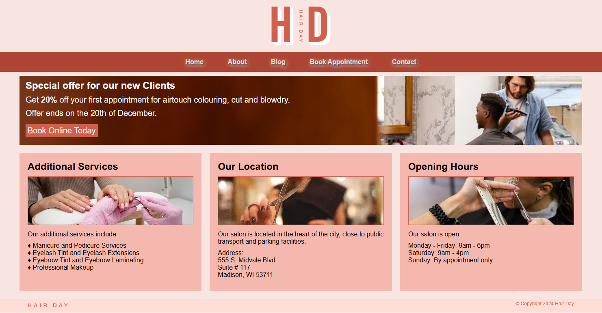

# **Hair Day Project**  
This repository contains my implementation of the Hair Day project from the [Meta Front-End Developer Professional Certificate](https://www.coursera.org/professional-certificates/meta-front-end-developer). The project focuses on designing and developing a scalable and responsive **Home Page** for a hair styling service.

## **Screenshot**  
  
*This is the responsive home page layout for the Hair Day project.*

## **About the Project**  
The Hair Day project is centered on creating a professional and user-friendly **Home Page** for a hair styling business. This includes:  
- Designing a clean and visually appealing layout  
- Ensuring the page is fully responsive and adapts to various screen sizes  
- Writing accessible and maintainable code  

## **Features**  
- **Home Page:** Displays an overview of services and key information about the business  
- **Scalable Design:** The layout adjusts seamlessly across mobile, tablet, and desktop devices  

## **Technologies Used**  
- **HTML5**: For the structure of the web page  
- **CSS3**: For styling, including Flexbox and Grid for layout  
- **Accessibility Standards**: Focused on semantic elements and responsive design best practices  

## **Learning Objectives**  
This project helped me develop and practice:  
- Building scalable and responsive web designs  
- Structuring web pages using semantic HTML  
- Styling layouts with modern CSS techniques

## **Acknowledgements**
A big thank you to the [Meta Front-End Developer Professional Certificate](https://www.coursera.org/professional-certificates/meta-front-end-developer) team for designing this project.  
Inspired by Meta’s commitment to advancing front-end development skills for all learners.  

## **License**
This repository is for educational purposes only. Feel free to explore and learn from the code.
